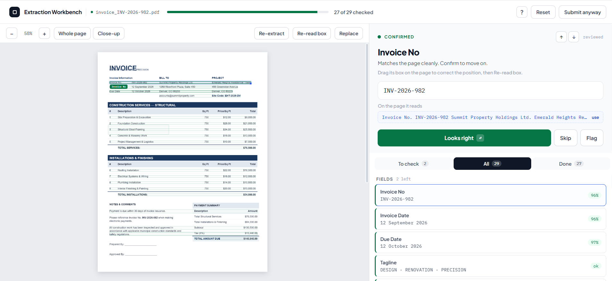

# Extraction Workbench

A single-file, client-side HTML application for reviewing and correcting AI-extracted data from scanned documents (invoices, forms, etc.) against a defined schema, before submitting the verified record to a parent application.

There is no build step or backend of its own — `extraction-workbench.html` is self-contained and runs entirely in the browser, using CDN-hosted libraries for PDF rendering and OCR.

## Screenshot



## What it does

1. **Upload** an image (JPG/PNG) or PDF (first page only) of a document.
2. The page runs **OCR** locally in the browser (Tesseract.js) to read text and locate it on the page.
3. The file is sent once to a configurable **AI extraction endpoint**, which maps the document's content onto a predefined schema (e.g. invoice number, vendor address, line items).
4. Each extracted field is shown as a **marker box** overlaid on the document image, color-coded by confidence/status, alongside a **review rail** where the operator can confirm, edit, flag, or skip each value.
5. Once every field is checked (or the operator chooses to submit early), the resulting JSON record is **posted back to the parent window** (`window.opener`) that launched the workbench.

## Key features

- **Document viewer** — zoom in/out, fit-to-page, and a "close-up" mode that automatically zooms/scrolls to keep the currently focused field centered and readable.
- **Draggable/resizable markers** — if a box is in the wrong place, drag it over the correct text and click "Re-read box" to re-run OCR on just that region.
- **Confidence-based status model** for every field/row:
  - **Confirmed (verified)** — user-confirmed, or high-confidence and located on the page.
  - **Needs a look (review)** — extracted but low-confidence, unplaced, or manually flagged.
  - **Not found (missing)** — nothing was extracted.
- **Review rail** with three views — *To check*, *All*, *Done* — plus a progress bar and running counts in the top bar.
- **Repeatable line-item groups** (e.g. `construction_services`, `installations_and_finishing`) driven by any schema field that declares a `nested` sub-schema; rows can be added by hand when none were detected.
- **One-click suggestions** — when the OCR reading of a field's box differs from the AI-extracted value, the raw OCR text is offered as a one-click "use" suggestion.
- **Keyboard-driven review**: press `?` to toggle the shortcut bar.

  | Key | Action |
  |---|---|
  | `Enter` | Confirm the focused item and move to the next |
  | `↑` / `↓` (or `k` / `j`) | Move through the queue |
  | `/` | Focus the value input |
  | `F` | Flag the item for later |
  | `S` | Skip the item |

- **JSON preview** — "View JSON" / "Copy JSON" in the rail footer show a live, human-readable snapshot of the record (labels, values, status, confidence, bounding boxes).
- **Reset** — reverts all edits back to the original AI-extracted baseline.

## Configuration

Two placeholders near the top of the `<script>` block must be set before deploying:

```js
const AI_URL = "<YOUR AI URL>";
```
The endpoint that receives the uploaded file (as `multipart/form-data`) and returns a JSON object matching `REFERENCE_SCHEMA`. The page's own query string (e.g. `?serializer=...&form_type=...`) is forwarded to this URL so the backend can resolve the correct schema/serializer.

```js
window.opener.postMessage({ data: data }, '<YOUR REDIRECT URL>');
```
The **target origin** used when posting the final submitted record back to the parent window. Must be set to the exact origin of the launching application (do not use `*` in production).

### Defining the schema

The extraction target schema is declared once, as `REFERENCE_SCHEMA` in the script:

```js
const REFERENCE_SCHEMA = {
  "invoice_no": "",
  "invoice_date": "",
  ...
  "construction_services": { "nested": {
    "description": "", "sq_ft": "", "price_per_sq_ft": "", "total": ""
  }}
};
```

- Top-level scalar keys become individual review fields.
- A key whose value is an object with a `nested` sub-object becomes a **repeatable group** (rendered as multiple rows, each with an "+ Row" button in the queue).
- Field labels are auto-generated by title-casing the snake_case key (e.g. `vendor_company_name` → "Vendor Company Name").

This schema is expected to mirror the backend serializer/model the extracted data will ultimately be saved to.

## Integration

This page is designed to be opened as a **popup/child window** from another application:

- On submit, it calls `window.opener.postMessage({ data }, REDIRECT_URL)` with the final record, shaped as `{ field_key: value, ..., group_key: [ {cell_key: value, ...}, ... ] }`.
- If there is no `window.opener` (e.g. opened directly), the record is logged to the console instead and a notice is shown.
- The parent application should listen for the `message` event and validate `event.origin` before trusting the payload.

## Dependencies (loaded via CDN)

- [pdf.js](https://cdnjs.cloudflare.com/ajax/libs/pdf.js/) — renders the first page of an uploaded PDF to a canvas.
- [Tesseract.js](https://cdn.jsdelivr.net/npm/tesseract.js/) — in-browser OCR, used both for initial text/line detection and for "Re-read box".
- Google Fonts: Plus Jakarta Sans (UI) and IBM Plex Mono (data/values).

If Tesseract.js fails to load, the workbench degrades gracefully: it skips OCR-based box placement and, if the AI extraction endpoint is also unreachable, falls back to naive `label: value` line matching against raw OCR text.

## Browser support

Requires a modern browser with support for ES modules, `fetch`, `FormData`, Canvas, and the Clipboard API. No server-side rendering or build tooling is involved — just open the HTML file (or serve it statically).
